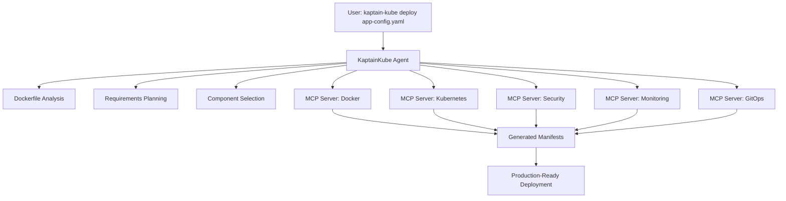

# KaptainKube Dockerfile Deployment

## AI-Driven Container-to-Production Pipeline

### Problem Statement

Modern containerized applications require extensive Kubernetes expertise to deploy securely and efficiently. Developers have a working Dockerfile but need dozens of additional components for production readiness: ingress controllers, service meshes, monitoring, autoscaling, security policies, and CI/CD pipelines. This complexity creates a significant barrier between "it works in Docker" and "it's production-ready on Kubernetes."

### Solution

KaptainKube's Dockerfile deployment capability transforms a simple container definition into a complete, production-grade Kubernetes deployment using an **AI-driven agentic workflow** that orchestrates specialized MCP (Model Context Protocol) servers.

**Single Command Deployment:**
```bash
kaptain-kube deploy app-config.yaml
```

This command activates the **KaptainKube Agent**, which:
1. **Analyzes** your Dockerfile and application requirements using AI reasoning
2. **Plans** the optimal architecture using the curated component library
3. **Executes** deployment actions by orchestrating specialized MCP servers
4. **Monitors** the deployment process and provides feedback

The agent acts as an intelligent orchestrator, while MCP servers handle the actual implementation tasks like Kubernetes manifest generation, security policy creation, and infrastructure provisioning.

## Quick Start

### Basic Deployment

**1. Create an application configuration:**
```yaml
# app-config.yaml
apiVersion: kaptainkube.dev/v1
kind: AppDeployment
metadata:
  name: my-web-app
spec:
  dockerfile: ./Dockerfile
  
  requirements:
    - "REST API with database backend"
    - "Handle 1000 concurrent users"
    - "High availability required"
  
  ports:
    - port: 8080
      protocol: HTTP
      path: "/api"
  
  resources:
    cpu: "500m"
    memory: "1Gi"
```

**2. Deploy to Kubernetes:**
```bash
kaptain-kube deploy app-config.yaml
```

**3. KaptainKube automatically provisions:**
- Kubernetes Deployment with optimized resource allocation
- Service and Ingress with Kong API Gateway
- Istio service mesh for mTLS and traffic management
- Prometheus monitoring and Grafana dashboards
- HPA/VPA for auto-scaling
- Security policies via OPA Gatekeeper
- CI/CD pipeline with Tekton and ArgoCD

## Configuration Specification

### AppDeployment Resource Schema

```yaml
apiVersion: kaptainkube.dev/v1
kind: AppDeployment
metadata:
  name: string                    # Application name
  namespace: string               # Target namespace (optional)
  labels: {}                      # Additional labels
spec:
  # Container Source
  dockerfile: string              # Path to Dockerfile (required if image not specified)
  image: string                   # Pre-built container image (alternative to dockerfile)
  buildContext: string            # Docker build context path (default: ".")
  
  # Application Requirements (Natural Language)
  requirements: []string          # High-level functional requirements
  
  # Service Configuration
  ports:
    - port: int                   # Container port
      protocol: string            # HTTP, HTTPS, TCP, UDP
      path: string                # URL path for HTTP services (optional)
      healthCheck: string         # Health check endpoint (optional)
  
  # Resource Specifications
  resources:
    cpu: string                   # CPU request/limit (e.g., "500m")
    memory: string                # Memory request/limit (e.g., "1Gi")
    storage: string               # Persistent storage size (optional)
    gpu: int                      # GPU count (optional)
  
  # Scaling Configuration
  scaling:
    minReplicas: int              # Minimum pod count (default: 1)
    maxReplicas: int              # Maximum pod count (default: 10)
    targetCPU: int                # CPU utilization % for HPA (default: 80)
    targetMemory: int             # Memory utilization % for VPA (optional)
  
  # Security & Compliance
  securityProfile: string         # "standard", "pci", "hipaa", "fips" (default: "standard")
  secretsRequired: []string       # List of secret names needed
  
  # Database Requirements
  database:
    type: string                  # "postgresql", "mysql", "mongodb", "redis"
    size: string                  # Storage size (e.g., "10Gi")
    backup: bool                  # Enable automated backups (default: true)
  
  # Advanced Configuration
  components:
    ingress:
      enabled: bool               # Enable ingress (default: true for HTTP services)
      className: string           # Ingress class (default: "kong")
      tls: bool                   # Enable TLS (default: true)
      annotations: {}             # Custom ingress annotations
    
    serviceMesh:
      enabled: bool               # Enable Istio (default: true)
      mTLS: string                # "strict", "permissive", "disabled" (default: "strict")
    
    monitoring:
      enabled: bool               # Enable observability stack (default: true)
      metrics: bool               # Prometheus metrics (default: true)
      traces: bool                # OpenTelemetry tracing (default: true)
      logs: bool                  # Centralized logging (default: true)
    
    autoscaling:
      enabled: bool               # Enable HPA/VPA (default: true)
      predictive: bool            # Enable predictive scaling (default: false)
    
    cicd:
      enabled: bool               # Enable CI/CD pipeline (default: true)
      gitRepo: string             # Git repository URL
      branch: string              # Target branch (default: "main")
      webhook: bool               # Enable Git webhooks (default: true)
```

## Architecture Integration

### Component Selection Matrix

KaptainKube automatically selects and configures components based on Dockerfile analysis and requirements:

| Dockerfile Analysis | Auto-Selected Components |
|---------------------|--------------------------|
| `EXPOSE 80/443` | Kong Ingress + cert-manager |
| `FROM postgres:*` | Skip database operator |
| `ENV DATABASE_URL` | Zalando Postgres Operator |
| `USER 1000:1000` | Restrictive security policies |
| `HEALTHCHECK` instruction | Kubernetes probes auto-configured |
| Multi-stage build | Optimize resource allocation |
| `COPY requirements.txt` | Language-specific monitoring |

### AI Analysis Engine

The deployment process uses LLM analysis to:

1. **Parse Dockerfile**: Extract runtime requirements, dependencies, and security context
2. **Analyze Requirements**: Map natural language requirements to technical components
3. **Resource Estimation**: Predict CPU/memory needs based on application type
4. **Security Assessment**: Determine appropriate security policies and compliance requirements
5. **Architecture Planning**: Select optimal component configuration

### Agentic Workflow Architecture



**Agent Reasoning Flow:**
1. **Context Gathering**: Agent analyzes Dockerfile, requirements, and current cluster state
2. **Planning**: AI reasons about optimal architecture based on the component library
3. **Task Decomposition**: Agent breaks down deployment into specialized tasks
4. **MCP Orchestration**: Agent calls appropriate MCP servers with specific parameters
5. **Validation**: Agent verifies outputs and handles any issues
6. **Deployment**: Agent applies generated resources and monitors progress

### Generated Kubernetes Resources

Through MCP server orchestration, KaptainKube generates:

```
📁 k8s-manifests/
├── 01-namespace.yaml              # Namespace with labels and policies
├── 02-secrets.yaml                # Auto-generated secrets and certificates
├── 03-configmap.yaml              # Application configuration
├── 04-deployment.yaml             # Main application deployment
├── 05-service.yaml                # ClusterIP service
├── 06-ingress.yaml                # Kong ingress with TLS
├── 07-hpa.yaml                     # Horizontal Pod Autoscaler
├── 08-vpa.yaml                     # Vertical Pod Autoscaler
├── 09-servicemonitor.yaml          # Prometheus monitoring
├── 10-networkpolicy.yaml           # Network security policies
├── 11-podsecuritypolicy.yaml       # Pod security standards
├── 12-istio-virtualservice.yaml    # Service mesh configuration
├── 13-istio-destinationrule.yaml   # Traffic policies
└── 14-argo-rollout.yaml            # Progressive delivery configuration

📁 ci-cd/
├── tekton-pipeline.yaml            # Build and test pipeline
├── tekton-trigger.yaml             # Git webhook trigger
└── argocd-application.yaml         # GitOps deployment

📁 monitoring/
├── grafana-dashboard.yaml          # Application-specific dashboard
├── prometheus-rules.yaml           # Alerting rules
└── jaeger-tracing.yaml             # Distributed tracing config
```

## MCP Server Requirements

To implement the Dockerfile deployment capability, KaptainKube requires the following specialized MCP servers:

### 1. **Docker Analysis MCP Server**
**Purpose**: Analyze Dockerfiles and container images for deployment planning

**Required Tools:**
- `analyze_dockerfile` - Parse Dockerfile and extract metadata
- `inspect_image` - Get runtime information from container images
- `estimate_resources` - Predict CPU/memory requirements
- `detect_dependencies` - Identify language/framework dependencies
- `security_scan` - Basic security analysis of container layers

**Required Resources:**
- `dockerfile_best_practices` - Documentation for Dockerfile optimization
- `base_image_catalog` - Information about common base images

### 2. **Kubernetes Manifest Generator MCP Server**
**Purpose**: Generate production-ready Kubernetes manifests

**Required Tools:**
- `generate_deployment` - Create Deployment manifests with best practices
- `generate_service` - Create Service manifests based on exposed ports
- `generate_configmap` - Create ConfigMaps for application configuration
- `generate_secrets` - Create Secret manifests for sensitive data
- `validate_manifests` - Validate generated YAML against Kubernetes API
- `apply_manifests` - Apply manifests to target cluster

**Required Resources:**
- `manifest_templates` - Template library for different resource types
- `kubernetes_schema` - Kubernetes API schema for validation

### 3. **Security Policy MCP Server**
**Purpose**: Generate security policies and compliance configurations

**Required Tools:**
- `generate_network_policy` - Create NetworkPolicy manifests
- `generate_psp` - Create PodSecurityPolicy/PodSecurityStandard
- `generate_rbac` - Create RBAC policies for applications
- `scan_vulnerabilities` - Security scanning of configurations
- `compliance_check` - Validate against compliance frameworks (PCI, HIPAA, etc.)

**Required Resources:**
- `security_baselines` - Security policy templates for different compliance levels
- `vulnerability_database` - Known vulnerabilities and mitigations

### 4. **Ingress & Networking MCP Server**
**Purpose**: Configure ingress controllers and networking

**Required Tools:**
- `generate_kong_ingress` - Create Kong Ingress configurations
- `generate_nginx_ingress` - Create NGINX Ingress configurations  
- `generate_certificates` - Create TLS certificate configurations
- `configure_load_balancer` - Set up load balancer configurations

**Required Resources:**
- `ingress_templates` - Templates for different ingress controllers
- `certificate_authorities` - CA configurations for different environments

### 5. **Service Mesh MCP Server**
**Purpose**: Configure Istio service mesh components

**Required Tools:**
- `generate_virtual_service` - Create Istio VirtualService
- `generate_destination_rule` - Create Istio DestinationRule
- `generate_gateway` - Create Istio Gateway configurations
- `configure_mtls` - Set up mutual TLS policies
- `configure_traffic_policy` - Set up traffic management rules

**Required Resources:**
- `istio_templates` - Service mesh configuration templates
- `traffic_patterns` - Common traffic management patterns

### 6. **Monitoring & Observability MCP Server**
**Purpose**: Set up comprehensive monitoring and observability

**Required Tools:**
- `generate_service_monitor` - Create Prometheus ServiceMonitor
- `generate_grafana_dashboard` - Create application-specific dashboards
- `generate_alert_rules` - Create Prometheus alerting rules
- `configure_jaeger_tracing` - Set up distributed tracing
- `configure_log_aggregation` - Set up log collection

**Required Resources:**
- `dashboard_templates` - Grafana dashboard templates by application type
- `alert_runbooks` - Runbook templates for common alerts

### 7. **Autoscaling MCP Server** 
**Purpose**: Configure horizontal and vertical pod autoscaling

**Required Tools:**
- `generate_hpa` - Create HorizontalPodAutoscaler
- `generate_vpa` - Create VerticalPodAutoscaler  
- `generate_keda_scaler` - Create KEDA ScaledObject for event-driven scaling
- `configure_cluster_autoscaler` - Set up cluster-level scaling
- `analyze_scaling_metrics` - Recommend optimal scaling configurations

**Required Resources:**
- `scaling_patterns` - Scaling configuration patterns by workload type
- `metrics_catalog` - Available metrics for scaling decisions

### 8. **Database Operator MCP Server**
**Purpose**: Deploy and configure database operators

**Required Tools:**
- `deploy_postgres_operator` - Deploy PostgreSQL using Zalando operator
- `deploy_mysql_operator` - Deploy MySQL operator
- `configure_backup` - Set up automated database backups
- `configure_replication` - Set up database replication
- `generate_connection_secrets` - Create database connection secrets

**Required Resources:**
- `operator_catalog` - Available database operators and configurations
- `backup_policies` - Backup and retention policies

### 9. **GitOps & CI/CD MCP Server**
**Purpose**: Set up GitOps workflows and CI/CD pipelines

**Required Tools:**
- `create_git_repository` - Create Git repository for GitOps
- `generate_tekton_pipeline` - Create Tekton build/test pipelines
- `configure_argocd_app` - Set up ArgoCD Application
- `setup_webhooks` - Configure Git webhooks for automation
- `generate_pipeline_triggers` - Create CI/CD triggers

**Required Resources:**
- `pipeline_templates` - CI/CD pipeline templates by language/framework
- `gitops_patterns` - GitOps repository structure patterns

### 10. **Cost Optimization MCP Server**
**Purpose**: Analyze and optimize deployment costs

**Required Tools:**
- `analyze_costs` - Estimate deployment costs
- `recommend_optimizations` - Suggest cost optimizations
- `configure_resource_quotas` - Set up resource quotas and limits
- `setup_cost_monitoring` - Configure cost tracking and alerts

**Required Resources:**
- `cost_models` - Cost models for different cloud providers
- `optimization_strategies` - Cost optimization strategies by workload type

## Implementation Steps

### Phase 1: Core Agent Implementation

#### 1.1 CLI Command Structure
```go
// Add to cmd/main.go
rootCmd.AddCommand(&cobra.Command{
    Use:   "deploy [config-file]",
    Short: "Deploy containerized application using AI-driven MCP orchestration",
    Long: `Activate the KaptainKube Agent to analyze your Dockerfile and requirements, 
    then orchestrate specialized MCP servers to generate and deploy a complete, 
    production-grade Kubernetes deployment.`,
    Args:  cobra.ExactArgs(1),
    RunE: func(cmd *cobra.Command, args []string) error {
        return RunDeployAgentCommand(cmd.Context(), *opt, args[0])
    },
})
```

#### 1.2 Agent Orchestrator
```go
// pkg/agent/deployment_agent.go
type DeploymentAgent struct {
    LLMClient    gollm.Client
    MCPManager   *mcp.Manager
    Config       AgentConfig
}

type AgentConfig struct {
    RequiredMCPServers []string
    MaxIterations      int
    ValidationStrict   bool
}

func (da *DeploymentAgent) ExecuteDeployment(ctx context.Context, config AppDeploymentConfig) error {
    // 1. Analyze Dockerfile and requirements
    analysis := da.analyzeRequirements(ctx, config)
    
    // 2. Create deployment plan
    plan := da.createDeploymentPlan(ctx, analysis)
    
    // 3. Orchestrate MCP servers
    return da.orchestrateMCPServers(ctx, plan)
}
```

#### 1.3 MCP Server Integration
```go
// pkg/agent/mcp_orchestrator.go
type MCPOrchestrator struct {
    manager    *mcp.Manager
    llmClient  gollm.Client
}

func (mo *MCPOrchestrator) CallMCPTool(ctx context.Context, serverName, toolName string, args map[string]interface{}) (string, error) {
    client, exists := mo.manager.GetClient(serverName)
    if !exists {
        return "", fmt.Errorf("MCP server %s not available", serverName)
    }
    
    return client.CallTool(ctx, toolName, args)
}
```

### Phase 2: MCP Server Development

#### 2.1 Docker Analysis MCP Server
**Technology Stack**: Node.js + TypeScript, Docker SDK
**Repository Structure**:
```
docker-analysis-mcp/
├── package.json
├── src/
│   ├── index.ts              # MCP server entry point
│   ├── tools/
│   │   ├── analyze-dockerfile.ts
│   │   ├── inspect-image.ts
│   │   ├── estimate-resources.ts
│   │   └── security-scan.ts
│   ├── resources/
│   │   ├── dockerfile-best-practices.ts
│   │   └── base-image-catalog.ts
│   └── utils/
│       ├── docker-client.ts
│       └── resource-estimator.ts
└── templates/
    └── analysis-templates/
```

**Key Implementation Steps**:
1. Set up MCP server boilerplate using `@modelcontextprotocol/sdk`
2. Integrate Docker SDK for container analysis
3. Implement Dockerfile parsing using AST analysis
4. Create resource estimation algorithms
5. Add security scanning with Trivy integration

**Example Tool Implementation**:
```typescript
// src/tools/analyze-dockerfile.ts
export const analyzeDockerfile = {
  name: "analyze_dockerfile",
  description: "Parse and analyze a Dockerfile for deployment planning",
  inputSchema: {
    type: "object",
    properties: {
      dockerfile_path: { type: "string" },
      build_context: { type: "string" }
    },
    required: ["dockerfile_path"]
  }
}
```

#### 2.2 Kubernetes Manifest Generator MCP Server
**Technology Stack**: Go + Kubernetes client-go
**Repository Structure**:
```
k8s-manifest-mcp/
├── go.mod
├── cmd/
│   └── server/
│       └── main.go
├── internal/
│   ├── server/
│   │   └── mcp_server.go
│   ├── tools/
│   │   ├── generate_deployment.go
│   │   ├── generate_service.go
│   │   └── validate_manifests.go
│   ├── templates/
│   │   ├── deployment.yaml.tmpl
│   │   └── service.yaml.tmpl
│   └── k8s/
│       └── client.go
└── pkg/
    └── generator/
        ├── manifest.go
        └── validator.go
```

**Key Implementation Steps**:
1. Set up Go MCP server using `github.com/mark3labs/mcp-go`
2. Integrate Kubernetes client-go for API validation
3. Create template engine with Go text/template
4. Implement manifest validation using dry-run
5. Add best practices enforcement

#### 2.3 Security Policy MCP Server
**Technology Stack**: Python + OPA/Gatekeeper, Kubernetes Python client
**Repository Structure**:
```
security-policy-mcp/
├── pyproject.toml
├── src/
│   ├── security_mcp/
│   │   ├── __init__.py
│   │   ├── server.py
│   │   ├── tools/
│   │   │   ├── generate_network_policy.py
│   │   │   ├── generate_psp.py
│   │   │   └── compliance_check.py
│   │   ├── resources/
│   │   │   ├── security_baselines.py
│   │   │   └── vulnerability_db.py
│   │   └── compliance/
│   │       ├── pci.py
│   │       ├── hipaa.py
│   │       └── fips.py
└── templates/
    ├── network-policies/
    ├── pod-security/
    └── rbac/
```

**Key Implementation Steps**:
1. Set up Python MCP server using `mcp` package
2. Integrate OPA/Gatekeeper policy templates
3. Create compliance framework mappings
4. Implement vulnerability scanning integration
5. Add policy validation and testing

### Phase 3: MCP Server Deployment & Configuration

#### 3.1 Container Images
Create Docker containers for each MCP server:
```dockerfile
# docker-analysis-mcp/Dockerfile
FROM node:18-alpine
WORKDIR /app
COPY package*.json ./
RUN npm ci --only=production
COPY dist/ ./dist/
EXPOSE 8080
CMD ["node", "dist/index.js"]
```

#### 3.2 MCP Configuration
Update KaptainKube's MCP configuration to include deployment servers:
```yaml
# ~/.config/kubectl-ai/mcp.yaml
servers:
  - name: docker-analysis
    url: "http://localhost:8001"
    timeout: 30
  - name: k8s-manifest-generator
    url: "http://localhost:8002"
    timeout: 60
  - name: security-policy
    url: "http://localhost:8003"
    timeout: 45
  - name: ingress-networking
    url: "http://localhost:8004"
  - name: service-mesh
    url: "http://localhost:8005"
  - name: monitoring-observability
    url: "http://localhost:8006"
  - name: autoscaling
    url: "http://localhost:8007"
  - name: database-operator
    url: "http://localhost:8008"
  - name: gitops-cicd
    url: "http://localhost:8009"
  - name: cost-optimization
    url: "http://localhost:8010"
```

### Phase 4: Integration and Testing

#### 4.1 Agent-MCP Integration Tests
```go
// test/agent/deployment_test.go
func TestDeploymentAgent(t *testing.T) {
    // Start MCP servers
    servers := startTestMCPServers(t)
    defer stopTestMCPServers(servers)
    
    // Initialize agent with test MCP manager
    agent := NewDeploymentAgent(testLLMClient, testMCPManager)
    
    // Test deployment scenarios
    testCases := []struct {
        name           string
        config         AppDeploymentConfig
        expectedTools  []string
        expectedOutputs []string
    }{
        {
            name: "simple web app",
            config: AppDeploymentConfig{...},
            expectedTools: []string{"analyze_dockerfile", "generate_deployment"},
            expectedOutputs: []string{"deployment.yaml", "service.yaml"},
        },
    }
    
    for _, tc := range testCases {
        t.Run(tc.name, func(t *testing.T) {
            err := agent.ExecuteDeployment(ctx, tc.config)
            assert.NoError(t, err)
            // Verify outputs...
        })
    }
}
```

#### 4.2 End-to-End Deployment Tests
```bash
#!/bin/bash
# test/e2e/test-deployment.sh

# Start local MCP servers
docker-compose -f test/e2e/mcp-servers.yml up -d

# Test deployment with sample Dockerfile
./kaptain-kube deploy test/fixtures/simple-web-app.yaml

# Verify generated resources
kubectl get deployment,service,ingress -n test-app

# Cleanup
docker-compose -f test/e2e/mcp-servers.yml down
```

## Usage Examples

### Simple Web Application

```yaml
# web-app.yaml
apiVersion: kaptainkube.dev/v1
kind: AppDeployment
metadata:
  name: blog-api
spec:
  dockerfile: ./Dockerfile
  requirements:
    - "REST API for blog platform"
    - "Serves 10,000 daily users"
    - "PostgreSQL database required"
  
  ports:
    - port: 3000
      protocol: HTTP
      path: "/api"
      healthCheck: "/health"
  
  database:
    type: postgresql
    size: "20Gi"
```

**Generated deployment includes:**
- Node.js application deployment with resource optimization
- PostgreSQL cluster with backup configuration
- Kong ingress with rate limiting
- Istio service mesh with circuit breakers
- Prometheus monitoring with custom dashboards
- HPA scaling based on request rate

### Microservice with gRPC

```yaml
# user-service.yaml
apiVersion: kaptainkube.dev/v1
kind: AppDeployment
metadata:
  name: user-service
spec:
  dockerfile: ./Dockerfile
  requirements:
    - "gRPC user management service"
    - "PCI compliance required"
    - "High availability with 99.9% uptime"
  
  ports:
    - port: 9090
      protocol: gRPC
  
  securityProfile: "pci"
  
  scaling:
    minReplicas: 3
    maxReplicas: 50
    targetCPU: 70
```

### Machine Learning Inference

```yaml
# ml-inference.yaml
apiVersion: kaptainkube.dev/v1
kind: AppDeployment
metadata:
  name: image-classifier
spec:
  dockerfile: ./Dockerfile
  requirements:
    - "TensorFlow image classification"
    - "GPU acceleration required"
    - "Model serving with batch processing"
  
  resources:
    gpu: 1
    memory: "8Gi"
  
  scaling:
    minReplicas: 1
    maxReplicas: 5
    predictive: true
```

## Error Handling & Troubleshooting

### Common Issues

**Dockerfile Analysis Failures:**
```bash
# Enable verbose analysis
kaptain-kube deploy app-config.yaml --analyze-verbose

# Manual Dockerfile validation
kaptain-kube validate-dockerfile ./Dockerfile
```

**Component Conflicts:**
```bash
# Show selected components and dependencies
kaptain-kube deploy app-config.yaml --dry-run --show-components

# Override component selection
kaptain-kube deploy app-config.yaml --disable-component=istio
```

**Resource Estimation Issues:**
```bash
# Override resource estimates
kaptain-kube deploy app-config.yaml --resources-cpu=1000m --resources-memory=2Gi
```

### Validation Commands

```bash
# Validate configuration before deployment
kaptain-kube validate app-config.yaml

# Generate manifests without applying
kaptain-kube deploy app-config.yaml --generate-only --output-dir=./k8s

# Show deployment plan
kaptain-kube deploy app-config.yaml --plan-only
```

## Future Enhancements

### Phase 5: Advanced AI Features

- **Auto-optimization**: Continuous resource and configuration optimization based on runtime metrics
- **Predictive scaling**: ML-based traffic prediction for proactive scaling
- **Security recommendations**: AI-driven security policy suggestions
- **Cost optimization**: Automated cost analysis and optimization recommendations

### Phase 6: Enterprise Features

- **Multi-cluster deployment**: Deploy across multiple Kubernetes clusters
- **Compliance automation**: Automated compliance reporting and policy enforcement
- **Disaster recovery**: Automated DR planning and testing
- **Advanced observability**: Custom SLI/SLO generation and monitoring

## Benefits

- **Developer Productivity**: Transform Dockerfile to production in minutes, not weeks
- **Production Readiness**: Automatic security, monitoring, and scaling configuration
- **Best Practices**: Enforced Kubernetes and cloud-native best practices
- **Consistency**: Standardized deployment patterns across teams
- **Reduced Complexity**: Abstract away Kubernetes complexity while maintaining flexibility
- **Cost Optimization**: Built-in resource optimization and scaling policies

## Integration with KaptainKube's MCP Infrastructure

KaptainKube already has robust MCP client infrastructure that this capability leverages:

### Existing MCP Infrastructure
- **Manager**: `pkg/mcp/manager.go` - Handles multiple MCP server connections
- **Client**: `pkg/mcp/client.go` - Provides unified interface for stdio and HTTP MCP servers  
- **Configuration**: `pkg/mcp/config.go` - YAML-based server configuration management
- **Authentication**: Support for Bearer tokens, Basic auth, API keys for remote servers

### Integration Points

#### 1. Agent Initialization
```go
// The deployment agent uses existing MCP infrastructure
func NewDeploymentAgent(mcpManager *mcp.Manager, llmClient gollm.Client) *DeploymentAgent {
    return &DeploymentAgent{
        MCPManager: mcpManager,
        LLMClient:  llmClient,
        // Inherits all existing MCP connection management
    }
}
```

#### 2. Tool Discovery & Registration
The deployment capability builds on KaptainKube's existing tool registration system:
```go
// Existing pattern in KaptainKube
mcpManager.RegisterTools(ctx, func(serverName string, tool mcp.Tool) error {
    // Register deployment-specific MCP tools
    if isDeploymentTool(tool) {
        return registerDeploymentTool(serverName, tool)
    }
    return nil
})
```

#### 3. Configuration Extension
Extends existing MCP configuration format:
```yaml
# ~/.config/kubectl-ai/mcp.yaml (existing format)
servers:
  # Existing servers (sequential-thinking, etc.)
  - name: sequential-thinking
    command: npx
    args: ["-y", "@modelcontextprotocol/server-sequential-thinking"]
  
  # New deployment-specific servers
  - name: docker-analysis
    url: "http://localhost:8001"
  - name: k8s-manifest-generator  
    url: "http://localhost:8002"
  # ... other deployment servers
```

### Deployment Workflow

1. **Startup**: KaptainKube connects to all configured MCP servers (existing + deployment)
2. **Command**: `kaptain-kube deploy` activates the deployment agent
3. **Execution**: Agent orchestrates deployment-specific MCP servers alongside existing ones
4. **Integration**: Seamless integration with existing kubectl-ai conversation flow

### Benefits of MCP-Based Architecture

- **Modularity**: Each deployment aspect (security, monitoring, etc.) is a separate MCP server
- **Extensibility**: Easy to add new capabilities by developing new MCP servers
- **Reusability**: MCP servers can be shared across different tools and platforms
- **Scalability**: Remote MCP servers can be deployed and scaled independently
- **Maintainability**: Clear separation of concerns between agent logic and implementation

This capability positions KaptainKube as the bridge between containerized applications and production-ready Kubernetes deployments, embodying the "describe the app; let the agent build the platform" vision through intelligent MCP orchestration. 